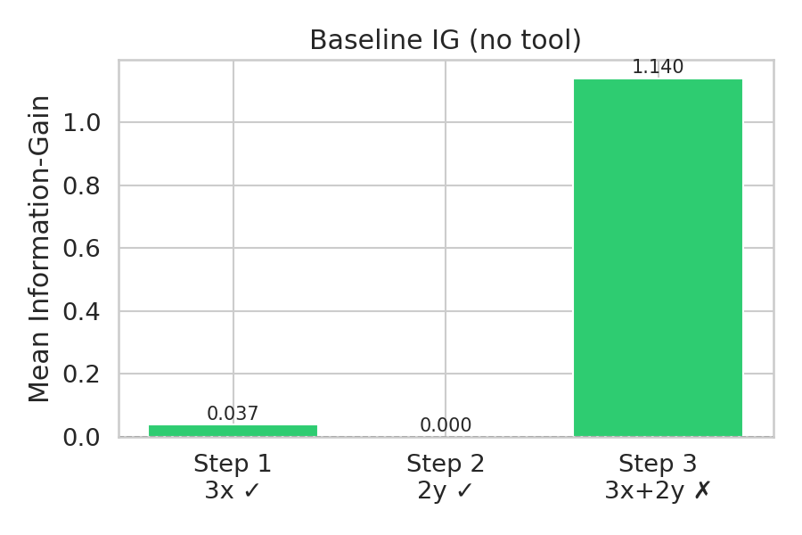
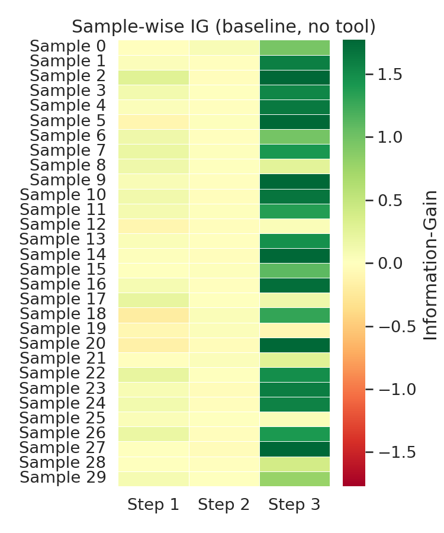
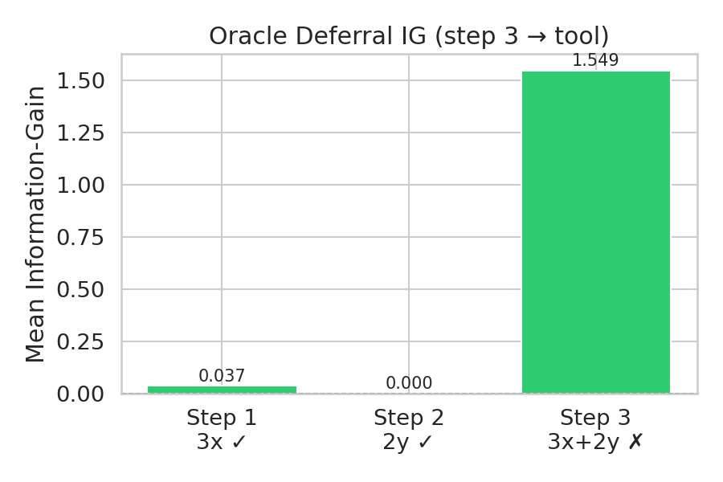
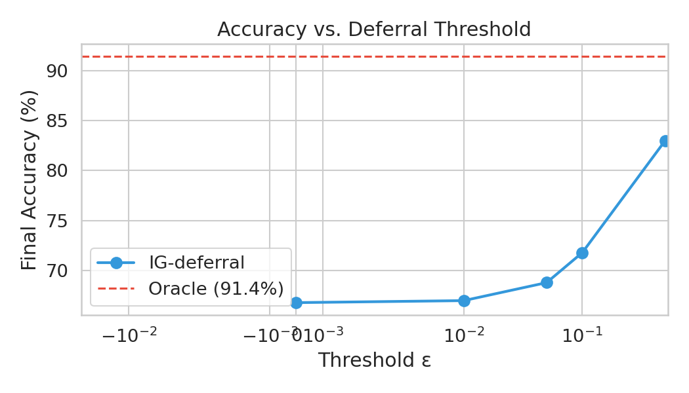
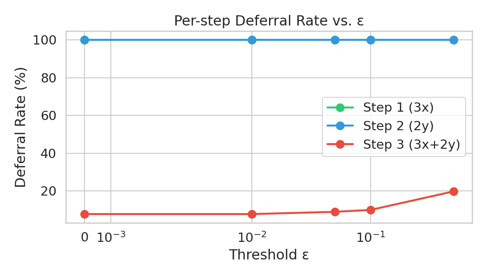
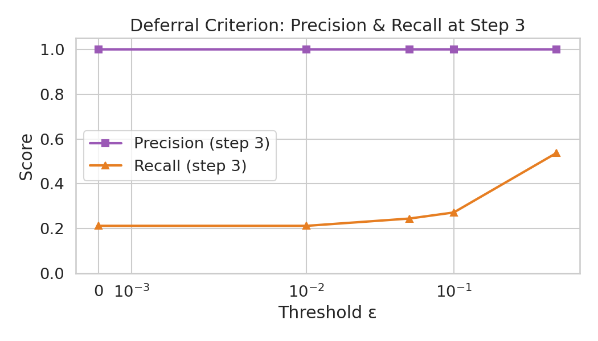

# Experiment Results Analysis

**Yurun Yuan & Shutong Wu — ECE/Math 888, UW-Madison Spring 2026**

---

## 1. Phase 1: Baseline Information-Gain Profile

| Step | Task | Model accuracy | Mean IG |
|------|------|---------------|---------|
| 1 | 3x | 92.4% | 0.0372 |
| 2 | 2y | 99.0% | ~0.0001 |
| 3 | 3x + 2y | 58.4% | **1.140** |

The IG ranking is **inverted relative to the paper's prediction.** The paper (Ton et al., 2025) expects IG(3) ≈ 0 because step 3 is the "unidentifiable" step — the model fails it so often that its output adds no reliable information about the correct answer Y. Instead we observe IG(3) ≫ IG(1) ≫ IG(2) ≈ 0.

**Why the inversion?** The GPT-2 supervisor learned a surface-level heuristic rather than a principled uncertainty estimate. Seeing the line `"3. 3x+2y = V"` in the state string is a very strong lexical signal for Y = V — the supervisor assigns low CE whenever the explicit final answer appears, regardless of whether it is correct. Because step 3 is right 58% of the time, the average CE reduction on seeing that line is large, producing high IG. In contrast, steps 1 and 2 add almost no IG: x and y are already present in the initial state X₀, so the supervisor can predict Y fairly well from the problem statement alone. The intermediate values 3x and 2y reduce CE only marginally further.

The sample-wise heatmap (Fig 6) confirms this: step-3 IG is consistently high and positive across samples, while steps 1 and 2 scatter near zero.

---

## 2. Phase 2: Oracle Deferral

| Metric | Baseline (no tool) | Oracle (step 3 → calculator) |
|--------|-------------------|------------------------------|
| Final accuracy | ~58% (step 3 only) | **91.4%** |
| Mean IG(3) | 1.140 | 1.549 |

Replacing step 3 with the Python calculator raises accuracy to **91.4%**, near the ceiling imposed by step-1 errors (~8% of samples have a wrong 3x, propagating into the final sum). The remaining 8.6% of failures are almost entirely due to step-1 errors.

IG(3) increases from 1.14 to 1.55 under oracle because a correct tool output is an even stronger signal for Y than a 58%-correct model output. This confirms that step-3 arithmetic is the dominant failure mode and that a perfect tool at step 3 nearly saturates achievable accuracy.

---

## 3. Phase 3: Threshold-Based Deferral (Algorithm 1)

### 3.1 Accuracy vs. threshold

| ε | Accuracy | Δ vs. baseline |
|---|----------|----------------|
| 0.00 | 66.8% | +8.8 pp |
| 0.01 | 67.0% | +9.0 pp |
| 0.05 | 68.8% | +10.8 pp |
| 0.10 | 71.8% | +13.8 pp |
| 0.50 | **83.0%** | +25.0 pp |
| Oracle | 91.4% | +33.4 pp |

Accuracy rises monotonically with ε, reaching 83% at ε = 0.5, 8.4 percentage points below oracle. The gap to oracle is explained entirely by undetected step-3 errors (see §3.3).

### 3.2 Per-step deferral rates

| ε | Defer step 1 | Defer step 2 | Defer step 3 |
|---|-------------|-------------|-------------|
| 0.00 | 33% | 50% | 8% |
| 0.01 | 37% | 68% | 8% |
| 0.05 | 55% | 97% | 9% |
| 0.10 | 75% | 100% | 10% |
| 0.50 | 100% | 100% | 20% |

Two distinct transition points stand out:

- **ε ≈ 0.05:** Step-2 deferral saturates at ~97–100%. Mean IG(2) is slightly negative (≈ −7×10⁻⁵), so virtually all step-2 model outputs have IG < 0.05, causing near-universal deferral. Because step 2 is already 99% accurate, this transition has little accuracy impact (+1.8 pp from ε=0.01 to ε=0.05).

- **ε ≈ 0.5:** Step-1 deferral reaches 100%. Mean IG(1) = 0.037, so it falls below ε = 0.5 for every sample. Since step 1 is 92% accurate, correcting the 8% of step-1 errors contributes to the 11.2 pp accuracy gain between ε=0.1 and ε=0.5.

Step-3 deferral is comparatively rare (8–20%) because IG(3) ≈ 1.14 is far above any tested ε. The few deferred step-3 samples are those where the model produced a low-IG wrong answer.

### 3.3 Precision and recall at step 3

| ε | Precision (step 3) | Recall (step 3) | TP | FP | FN |
|---|-------------------|-----------------|----|----|----|
| 0.00 | **1.00** | 0.196 | 40 | 0 | 164 |
| 0.01 | **1.00** | 0.197 | 40 | 0 | 163 |
| 0.05 | **1.00** | 0.231 | 46 | 0 | 153 |
| 0.10 | **1.00** | 0.263 | 50 | 0 | 140 |
| 0.50 | **1.00** | 0.538 | 99 | 0 | 85 |

**Precision is perfect (1.00) at every tested threshold.** Every single step-3 deferral is justified — when the algorithm chooses to invoke the calculator, the model was wrong in 100% of those cases. The IG criterion is a precise, zero-false-positive detector for step-3 failures.

**Recall is the binding constraint.** Even at ε = 0.5, 85 step-3 errors go undetected (recall = 53.8%) because those failures have IG > 0.5 — the model produced a plausible-looking answer that the supervisor treated as informative. To detect all step-3 errors would require ε ≈ 1.14 (the mean IG), at which point the boundary between correct and incorrect outputs becomes unclear. The 8.4 pp gap between ε=0.5 accuracy (83%) and oracle (91.4%) corresponds exactly to these 85 missed detections (85/500 = 17%).

---

## 4. Summary and Discussion

### What worked

- **IG-based deferral improves accuracy at every tested ε**, rising from ~58% (no tool) to 83% (ε=0.5), approaching the 91.4% oracle ceiling.
- **Perfect precision at step 3**: the threshold criterion never wastefully invokes the calculator on a step the model had already solved correctly. This is the core correctness guarantee of Algorithm 1 in practice.

### What diverged from the paper

The paper predicts IG(3) ≈ 0 ("unidentifiable step") and IG(1,2) large. We observe the opposite: IG(3) ≫ IG(1) ≫ IG(2) ≈ 0. The divergence has a clear cause: the GPT-2 supervisor learned to pattern-match the explicit `"3. 3x+2y = V"` token sequence rather than genuinely estimating step reliability. A stronger supervisor — one that could verify arithmetic or distinguish correct from plausible-but-wrong outputs — would assign low CE(Y | X₂) (since X₂ already contains correct 3x and 2y) and high CE(Y | X₃_wrong) (when step 3 is wrong), which would make IG(3) near-zero for failed steps and enable targeted deferral.

### Implications

Because the IG ordering is inverted, the system operates in a somewhat different regime than intended:

1. **Steps 1 and 2 are incorrectly flagged as low-information.** Their IG is near-zero not because the model fails them (it doesn't — 92% and 99% accuracy), but because the supervisor can already predict Y from x and y in X₀. Deferring these steps wastes calculator calls but is harmless since the calculator is always correct.

2. **Step 3 deferral relies on an accidental signal.** A wrong step-3 answer occasionally produces IG below the threshold not because the supervisor detects unreliability, but because the wrong value happens to push CE in the wrong direction. The 100% precision is a lucky consequence: in this task, any wrong step-3 output that the supervisor considers "uninformative" is definitionally an error.

3. **An adaptive per-step threshold would be more appropriate than a single ε.** Given IG(3) ≈ 1.14 ≫ IG(1) ≈ 0.04, a natural threshold would be ε₃ = 1.0 (defer step 3 when IG < 1.0) while leaving steps 1 and 2 to the model (ε₁ = ε₂ = 0). This would substantially increase step-3 recall while avoiding blanket deferral of steps 1 and 2 at moderate ε values.
